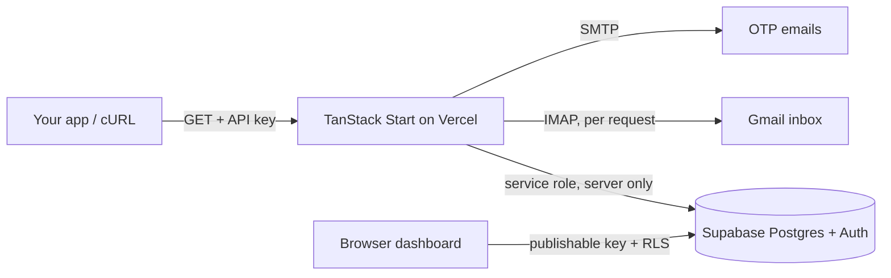

<div align="center">


<a href="https://fusioniuapi.vercel.app">
  
</a>

<br/>

[](https://fusioniuapi.vercel.app)
[](./LICENSE)
[](https://github.com/mespark)


</div>

---

## Overview

**fusioniuApi** is a small self-hosted API for two jobs: generating UPI payment QR codes, and checking whether a payment arrived by reading the confirmation email in a Gmail inbox over IMAP.

Two endpoints. Plain `GET` requests. JSON responses. A dashboard lets each user create and manage API keys, and an admin panel lets you monitor and block abusers.

> **Important.** This is a hobby-grade tool, not a payment gateway. Email-based verification cannot replace a gateway's server-to-server confirmation. Read [Limitations](#limitations) before using it for real money.

## Table of Contents

- [Features](#features)
- [How it works](#how-it-works)
- [Tech stack](#tech-stack)
- [Getting started](#getting-started)
- [Environment variables](#environment-variables)
- [API reference](#api-reference)
- [Deploy on Vercel](#deploy-on-vercel)
- [Security notes](#security-notes)
- [Limitations](#limitations)
- [Disclaimer](#disclaimer)
- [Author](#author)
- [Contact](#contact)
- [License](#license)

## Features

| | |
|---|---|
| **Instant QR generation** | Turn any UPI ID, amount and payee name into a scannable QR (base64 PNG) |
| **Payment verification** | Finds the confirmation email in Gmail (last 7 days) and matches it by UTR or transaction ID |
| **One-time verification** | Each UTR or transaction ID can be verified only once (enforced by a unique DB constraint) |
| **API key auth** | Per-user keys with usage counter, last-used time and an on/off switch |
| **OTP signup** | Email OTP verification before an account is created |
| **Dashboard and admin panel** | Manage keys, watch activity, block users |
| **Row Level Security** | Every table has RLS enabled; admin access is decided in the database by `has_role()` |

## How it works



1. A user signs up (email OTP), then creates an API key in the dashboard.
2. `GET /api/public/genqr` returns a QR for the given UPI ID and amount.
3. After the customer pays, `GET /api/public/check` logs in to the merchant's Gmail with an App Password, searches recent "You received" emails, and matches the UTR or transaction ID and the amount.
4. A matched transaction is recorded in `verified_transactions`, so it cannot be verified twice.

## Tech stack

- [TanStack Start](https://tanstack.com/start), React 19, file-based routing and SSR
- [Supabase](https://supabase.com): Postgres, Auth, Row Level Security
- Tailwind CSS v4 and shadcn/ui, Three.js hero
- `imapflow` (Gmail IMAP), `nodemailer` (OTP emails), `qrcode`
- Nitro, deployed to Vercel serverless

## Getting started

### Prerequisites

- [Bun](https://bun.sh) and Node.js 20.19+ (or 22+)
- A [Supabase](https://supabase.com) project
- A Gmail account with an [App Password](https://myaccount.google.com/apppasswords) to send signup OTP emails

### Setup

```bash
# 1. Clone
git clone https://github.com/mespark/fusioniuapi.git
cd fusioniuapi

# 2. Install
bun install

# 3. Environment
cp .env.example .env
# fill in the values (see the table below)

# 4. Database: open supabase/setup.sql, replace admin@example.com with your
#    admin email, then run the whole file in the Supabase SQL Editor.

# 5. Run
bun run dev
```

The app runs at `http://localhost:3000`.

**Admin email.** The admin account is identified by email in three places. Set the same address in all of them before you deploy:

- `supabase/setup.sql` (grants the `admin` role on signup)
- `src/routes/admin.tsx` (`ADMIN_EMAIL`)
- `src/components/SiteLayout.tsx` (`isAdmin`)

Then sign up with that email to get access to `/admin`. Real access control is enforced in the database by `has_role()`, the two code checks only decide what the UI shows.

> `supabase/migrations/` holds historical schema snapshots. Do not apply them one after another, use `supabase/setup.sql` on a fresh project.

## Environment variables

See [`.env.example`](./.env.example).

| Variable | Used by | Description |
|---|---|---|
| `SUPABASE_URL`, `VITE_SUPABASE_URL` | server, browser | Supabase project URL |
| `SUPABASE_PUBLISHABLE_KEY`, `VITE_SUPABASE_PUBLISHABLE_KEY` | server, browser | Publishable (anon) key |
| `SUPABASE_SERVICE_ROLE_KEY` | server only | Secret key. Never commit it, never prefix it with `VITE_` |
| `GMAIL_USER`, `GMAIL_APP_PASSWORD` | server | Gmail account and App Password that send signup OTP emails |

> Never commit `.env`. On Vercel, add these under Project Settings, Environment Variables.

## API reference

Interactive docs are available at `/docs` once the app is running. Both endpoints need an API key created in your dashboard.

### Generate a QR code

```
GET /api/public/genqr?key=YOUR_API_KEY&upi=yourname@fam&amount=10&name=My%20Store
```

```json
{ "status": "success", "data": { "qr_image": "data:image/png;base64,..." } }
```

### Verify a payment

```
GET /api/public/check?key=YOUR_API_KEY&mail=you@gmail.com&apppass=APP_PASSWORD&utr=UTR_NUMBER&amount=10
```

Use `txnid=` instead of `utr=` to match by transaction ID.

```json
{
  "status": "success",
  "data": { "sender_name": "John Doe", "amount": 10, "verified_at": "19-08-2026 14:32:10" }
}
```

### Status codes

| Code | Meaning |
|---|---|
| 200 | Payment found and verified |
| 400 | Missing or invalid parameters |
| 401 | Missing or invalid API key, or Gmail login failed |
| 403 | API key disabled or account blocked |
| 404 | No matching payment email found |
| 409 | Transaction already verified, or amount mismatch |

## Deploy on Vercel

1. Import the repository at [vercel.com/new](https://vercel.com/new).
2. Add the environment variables from the table above.
   - `VITE_*` variables are embedded in the browser bundle, so Vercel does not allow them to be marked Sensitive.
   - Mark `SUPABASE_SERVICE_ROLE_KEY` and `GMAIL_APP_PASSWORD` as **Sensitive**.
3. Deploy. After changing any `VITE_*` variable, redeploy without build cache.

## Security notes

- Secrets live in environment variables. The service role key is used only on the server.
- RLS is enabled on every table. Admin rights are stored in `user_roles` and checked in the database.
- The Gmail App Password is used for one IMAP session per verification request and is not stored by the app.
- **Query strings can end up in logs.** `apppass` is sent as a URL parameter, so your hosting provider, proxies or browser history may record it. Use a dedicated Gmail account that only receives payment emails, revoke the App Password if you suspect exposure, and prefer server-to-server calls over browser calls.

## Limitations

- Verification trusts what is in the mailbox. It is not a cryptographic proof of payment.
- It depends on the wording of one provider's confirmation email ("You received ..."). If that format changes, matching can break.
- It reads only the last 7 days of mail.
- There is no built-in rate limiting beyond API key checks.

For anything where money is at stake, confirm the payment with your bank or payment gateway as well.

## Disclaimer

This project is not affiliated with, endorsed by, or connected to FamPay, Google, NPCI or any bank or payment provider. Names are used only to describe compatibility. You are responsible for following the terms of the services you connect and the laws that apply to you. The software is provided as is, see the license.

## Author

Built and maintained by **[mespark](https://github.com/mespark)**.

If you fork or reuse this project, please keep the license notice intact.

## Contact

Questions, feedback or collaboration:

- Email: **contact@mespark.in**
- Telegram: [@btwspark](https://t.me/btwspark)

## License

Released under the **MIT License**, see [`LICENSE`](./LICENSE).

<div align="center">

</div>
